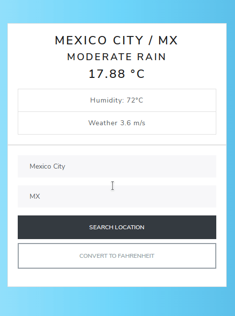

<!-- PROJECT SHIELDS -->
<!--
*** "reference style" links are used for readability.
*** Reference links are enclosed in brackets [ ] instead of parentheses ( ).
*** See the bottom of this document for the declaration of the reference variables
*** for contributors-url, forks-url, etc. This is an optional, concise syntax you may use.
*** https://www.markdownguide.org/basic-syntax/#reference-style-links
-->

[![Contributors][contributors-shield]][contributors-url]
[![Forks][forks-shield]][forks-url]
[![Stargazers][stars-shield]][stars-url]
[![Issues-open][issues-open-shield]][issues-open-url]
[![Issues-closed][issues-closed-shield]][issues-closed-url]

# weather-app

> A Weather App build with Vanilla JS

</br>
<div align="center">
    
    <a href="http://weather-app-dev.surge.sh/"><h1 width="90">Weather App</h1></a>
</div>

# Table of Contents

- [About](#about)
- [Getting Started](#getting-started)
  - [Prerequisites](#prerequisites)
  - [Setup](#setup)
  - [Available scripts](#available-scripts)
- [Live Demo](#live-demo)
- [Built With](#built-with)
- [Tests](#tests)
- [Authors](#authors)
- [Contributing](#contributing)
- [Show your support](#show-your-support)
- [Acknowledgments](#acknowledgments)
- [License](#license)

# About

The Weather App project tests asynchronous communication with promises or async/await and when to use them.

# Getting Started

> To get a local copy up and running follow these simple example steps:

## Prerequisites

- `npm`
- `git`

## Setup

To install the app locally

`git clone git@github.com:fabricio-garcia/weather-app.git` <br>
`cd weather-app` <br>

```javascript
npm i
```

- Start the game in your browser by typing:

```javascript
npm run start
```

and go to http://localhost:8080/

## Available scripts

- `npm run start`: Runs the app in the development mode.

- `npm run build`: Builds the app for production to the build folder.

# Live Demo

[Weather App live](https://weather-app-dev.surge.sh)

# Built With

- [JavaScript](https://developer.mozilla.org/en-US/docs/Web/JavaScript)
- [Babel](https://babeljs.io/)
- [WebPack](https://webpack.js.org/)
- [VS Code](https://code.visualstudio.com/)
- [Kubuntu](https://kubuntu.org/)
- Love and Passion for code

# Tests

- No automated tests for this project have been implemented but it is something that should eventually be added.

# Author

👤 **Fabricio Garcia**

- Github: [@fabricio-garcia](https://github.com/fabricio-garcia)
- Twitter: [@fabgrel10](https://twitter.com/fabgrel10)
- LinkedIn: [@fabricio-garcia](https://linkedin.com/fabricio-garcia)

# Contributing

Contributions, issues and feature requests are welcome! 🤝

You can also check the [issues page](issues/).

# Show your support

Give a ⭐️ if you like this project!

# Acknowledgments

- [The Odin Project](https://www.theodinproject.com/courses/javascript/lessons/weather-app)

# License

This project is licensed under the Apache 2.0 License \
Feel free to fork this project and improve it

<!-- MARKDOWN LINKS & IMAGES -->
<!-- https://www.markdownguide.org/basic-syntax/#reference-style-links -->

[contributors-shield]: https://img.shields.io/github/contributors/fabricio-garcia/weather-app?style=plastic
[contributors-url]: https://github.com/fabricio-garcia/weather-app/graphs/contributors
[forks-shield]: https://img.shields.io/github/forks/fabricio-garcia/weather-app?style=plastic
[forks-url]: https://github.com/fabricio-garcia/weather-app/network/members
[stars-shield]: https://img.shields.io/github/stars/fabricio-garcia/weather-app?style=plastic
[stars-url]: https://github.com/fabricio-garcia/weather-app/stargazers
[issues-open-shield]: https://img.shields.io/github/issues/fabricio-garcia/weather-app?style=plastic
[issues-closed-url]: https://github.com/fabricio-garcia/weather-app/issues
[issues-closed-shield]: https://img.shields.io/github/issues-closed/fabricio-garcia/weather-app?style=plastic
[issues-open-url]: https://github.com/fabricio-garcia/weather-app/issues
